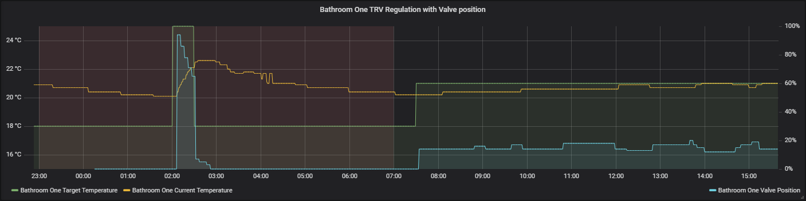

# EUROTRONIC TRV Valve position helper

[](https://github.com/custom-components/hacs)

Small helper [AppDaemon](https://github.com/home-assistant/appdaemon) application for EUROTRONIC Z-Wave TRVs.

__SPIRIT Z-Wave Plus__ is definitely supported: [Product page](https://eurotronic.org/produkte/z-wave-heizkoerperthermostat/spirit-z-wave-plus/) | [Z-Wave Device Database Entry](https://www.cd-jackson.com/index.php/zwave/zwave-device-database/zwave-device-list/devicesummary/710)

Maybe other TRVs from EUROTRONIC will work as well.

## Features

* allows access to `valve position (%)` value from Z-Wave TRVs in [Home Assistant](https://www.home-assistant.io/)
  * normally Home Assistant doesn't expose this value (at least in version 0.103)
* periodically reads OpenZWave log file and parses values from there
* this value is useful:
  * when you want to monitor what's going on and how well the internal regulation of the TRV performs
  * for detection of some conditions that require attention, like when the valve is stuck and not able to move or when the TRV is not able to detect "closed" position of the valve

## TRV configuration

For successful operation you have to configure your TRV to report valve opening percentage values. Go to your Home Assistant Z-Wave control panel, select TRV Z-Wave node and then in Node Config Options change parameter `Valve Opening Percentage Report` to some reasonable value (say 2-5).

This application is suitable for operating the TRV in ordinary "Heat" mode, when the regulation is performed by the TRV itself and Home Assistant only manages the setpoint temperature. The TRV also allows "Manufacturer specific" mode or preset when the internal regulation algorithm is switched off and external system is able to control the valve opening percentage directly. Unfortunately Home Assistant doesn't support this mode (at least in version 0.103) and it's not possible to modify the value even through low-level services (like zwave.set\_node\_value even with known value\_id).

More information:

* https://github.com/home-assistant/home-assistant/issues/14526
* https://github.com/home-assistant/home-assistant/pull/18138
* https://community.home-assistant.io/t/eurotronic-spirit-temperature-not-changing/32335

## Installation

Use [HACS](https://github.com/custom-components/hacs) or [download](https://github.com/jmarsik/ad-eurotronic-trv-valvepos/releases) the `eurotronic-trv-valvepos` directory from inside the `apps` directory here to your local `apps` directory, then add the configuration to enable the `eurotronic-trv-valvepos` module.

## AppDaemon app configuration

```yaml
eurotronic-trv-valvepos:
  module: eurotronic-trv-valvepos
  class: EurotronicTRVValvePos
  ozw_log_path: "/config/OZW_Log.txt"
  look_for_productname: "EUR_SPIRITZ Wall Radiator Thermostat"
  refresh_seconds: 300
```

Key | Required | Type | Default | Description
-- | -- | -- | -- | --
`module` | True | string | | Module name, should be `eurotronic-trv-valvepos`
`class` | True | string | | App class name, should be `EurotronicTRVValvePos`
`ozw_log_path` | False | string | `/config/OZW_Log.txt` | Path to OZW log file, default works in [Hass.io](https://www.home-assistant.io/hassio/)
`look_for_productname` | False | string | `EUR_SPIRITZ Wall Radiator Thermostat` | Z-Wave product name to look for when searching for TRV Z-Wave device entities, default works for SPIRIT Z-Wave Plus TRV
`refresh_seconds` | False | integer | 300 | Seconds between log scans

## Troubleshooting

Look for errors in AppDaemon log, this application logs all relevant information. You can even turn DEBUG logging on to see a little bit more.

## Sample data

Below is a screenshot from Grafana showing data from one TRV performing its duties.


